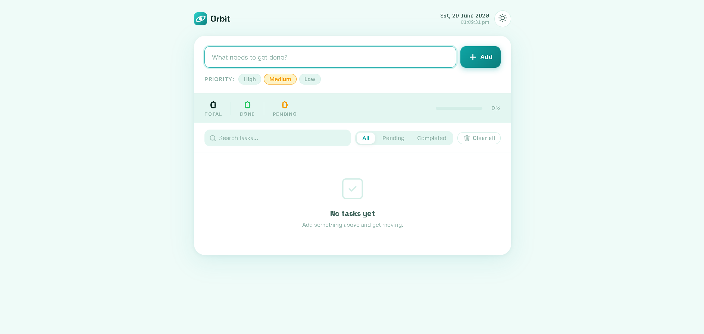
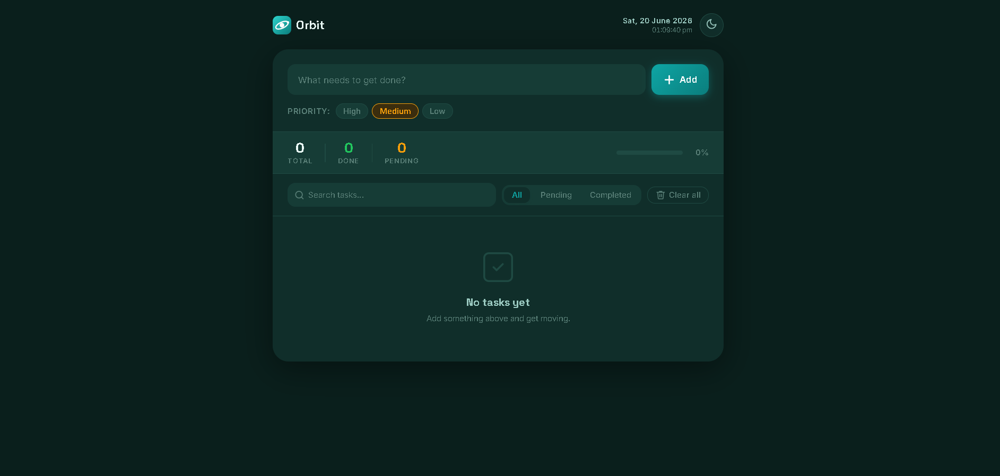
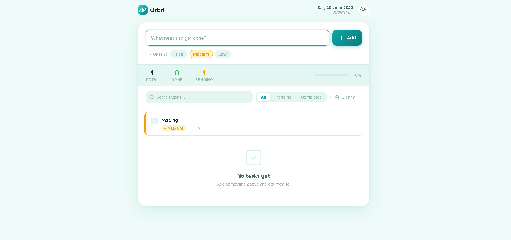

# Orbit — To-Do App (Task 5)

A clean, fast, dependency-free to-do list app built with plain HTML, CSS, and JavaScript — no frameworks, no build step.

**Live demo:** https://sanath00007.github.io/synent-task5-todoapp-sanathk/

---

## Objective

Build a fully functional, responsive to-do list application from scratch using only core front-end technologies (HTML, CSS, JavaScript), demonstrating DOM manipulation, application state management, and persistent storage — without relying on any external framework or library.

## Steps Performed

1. Planned the feature set and UI layout — task CRUD, priority levels, filters, search, and a stats bar.
2. Built the semantic HTML structure (`index.html`) for the app shell, task list, and modal.
3. Designed the visual theme in `style.css` using CSS custom properties, supporting both light and dark modes, with Space Grotesk (headings) and Inter (body) typography.
4. Implemented core logic in `script.js`: add/edit/delete/complete tasks, priority tagging, live search, filtering (All/Pending/Completed), and a confirmation modal for "Clear All".
5. Added persistence using the browser's `localStorage` API so tasks and theme choice survive page reloads.
6. Layered in accessibility and polish: ARIA labels, visible focus states, `prefers-reduced-motion` support, keyboard shortcuts (`Enter` / `Escape`), and toast notifications for key actions.
7. Tested across screen sizes and modern browsers, then deployed via GitHub Pages.

## Tools Used

| Category | Tools / Technologies |
|---|---|
| Markup & Styling | HTML5, CSS3 (custom properties, Flexbox) |
| Logic | Vanilla JavaScript (ES6) |
| Persistence | Browser `localStorage` API |
| Fonts | Google Fonts (Space Grotesk, Inter) |
| Version Control / Hosting | Git, GitHub, GitHub Pages |

## Outcome

A fully working, deployed to-do app with priority-based task management, instant search/filtering, light/dark theming, and persistent local storage — meeting all Task 5 deliverables with no external dependencies.

---

## Features

- Add, edit, complete, and delete tasks with inline editing
- Priority levels — High, Medium, Low — each with its own color accent
- Filters — view All, Pending, or Completed tasks
- Live search — instantly filter tasks by keyword
- Stats bar — total, done, and pending counts with a progress bar
- Clear All with a confirmation modal to prevent accidental wipes
- Light / Dark mode with a one-click toggle (preference is remembered)
- Live date & time display in the header
- Toast notifications for add, complete, edit, delete, and clear actions
- Persistent storage via `localStorage`
- Keyboard support — `Enter` to add/save, `Escape` to cancel/close
- Accessible — semantic markup, ARIA labels, focus states, reduced-motion support
- Responsive — works on desktop and mobile

## File Structure

```
.
├── index.html      # App markup / structure
├── style.css       # Styling, theming (light & dark), animations
├── script.js       # App logic, state management, and persistence
├── screenshots/     # App screenshots (see below)
└── reports/         # Brief write-up / task report (see below)
```

## Getting Started

No installation or build tools required.

1. Download/clone the repository.
2. Open `index.html` in any modern web browser.

That's it — the app runs entirely client-side.

## Usage

- **Add a task:** Type into the input field, choose a priority, press `Enter` or click **Add**.
- **Complete a task:** Click the checkbox next to a task.
- **Edit a task:** Click the pencil icon, update the text, press `Enter` or click save. `Escape` cancels.
- **Delete a task:** Click the trash icon.
- **Search:** Type in the search bar to filter tasks by text in real time.
- **Filter:** Use the All / Pending / Completed tabs.
- **Clear all tasks:** Click **Clear all** and confirm — this cannot be undone.
- **Toggle theme:** Click the sun/moon icon to switch between light and dark mode.

## Data Persistence

Tasks and theme preference are stored locally in the browser under:

- `orbit_tasks` — the task list (JSON)
- `orbit_theme` — `light` or `dark`

No data is sent to a server; clearing browser storage resets the app.

## Screenshots

> 
> 
> 


## Browser Support

Works in all modern evergreen browsers (Chrome, Edge, Firefox, Safari) that support CSS custom properties, `:has()`, and `localStorage`.

## License

Free to use, modify, and distribute for personal or academic projects.
